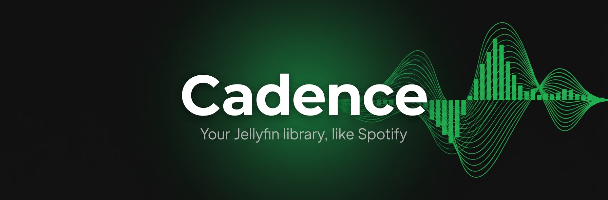

<p align="center">
  
</p>

<p align="center">
  <a href="https://github.com/johnpc/cadence/actions/workflows/ci.yml"></a>
  
</p>

# Cadence

**A Spotify-like music client for your self-hosted Jellyfin server.** Your whole library isn't a
giant scroll list — you discover through **recommendations, search, and playlists**, and build your
own world by adding songs to your **library, playlists, and liked songs**.

Log in with your Jellyfin account and everything is yours: your liked songs, your playlists, your
recommendations — all backed by the Jellyfin server you already run.

## Features

| Feature                                       | Status |
| --------------------------------------------- | ------ |
| Spotify-style shell (Home / Search / Library) | ✅     |
| Light / Dark / System theme                   | ✅     |
| Log in with your Jellyfin account             | ✅     |
| Playback + persistent Now-Playing bar         | ✅     |
| Search (the primary discovery surface)        | ✅     |
| Liked songs                                   | ✅     |
| Playlists (browse, create, add)               | ✅     |
| Home recommendations (recently added, radio)  | ✅     |
| Native iOS (background audio, lock-screen)    | ⬜     |
| Fuzzy search via Meilisearch                  | ⬜     |

## The vision

Spotify's magic isn't the size of the catalog — it's that you never see the catalog. You see **a few
things worth playing right now**: recommendations tuned to you, a fast search box, and the playlists
and songs you've saved. Cadence brings that shape to the music you already own on Jellyfin.

## Architecture

Cadence is a **static PWA** (Ionic 8 + React 19 + TypeScript, built with Vite, wrapped with
Capacitor for iOS). It has **no backend of its own** — your Jellyfin server _is_ the backend:

- **Jellyfin** handles auth, the library, liked songs (favorites), playlists, streaming, and
  recommendations/radio (instant mixes) — all natively, all per-user.
- The browser talks to Jellyfin **directly** (CORS-enabled), so there's no proxy in the hot path.
- **Search** starts on Jellyfin's native search and later upgrades to **Meilisearch** (via the
  self-hosted `marlin-search` indexer) for fuzzy, typo-tolerant results.

### Where the data comes from

Everything you see is **your Jellyfin server's real data**, read live over its HTTP API. Cadence
stores nothing of its own except your session token and your theme choice (on-device). Liking a song
or creating a playlist writes straight to Jellyfin — so it shows up in every other Jellyfin client
too.

## Deployment

Cadence is **live at [cadence.jpc.io](https://cadence.jpc.io)** — a small nginx container (`deploy/`)
running on the homelab via Dockge, fronted by cloudflared. Install it as a PWA from the browser, or
grab the iOS build from TestFlight (once live).

## Develop

```bash
npm install
npm run dev            # Vite dev server on :5173
npm run quality        # full gate: lint + format + lines + features + coverage + crap + build
npm run test:e2e       # Gherkin acceptance tests (Playwright + playwright-bdd)
npm run gen:icons      # regenerate app icons from assets/icon*.png
```

The Jellyfin base URL is a build-time constant (`VITE_JELLYFIN_URL`, defaulted in `.env`).
