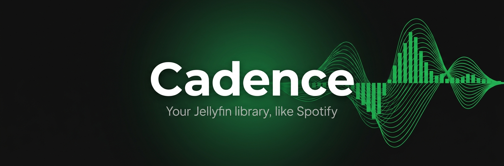

<p align="center">
  
</p>

<p align="center">
  <a href="https://github.com/johnpc/cadence/actions/workflows/ci.yml"></a>
  
</p>

# Cadence

**A Spotify-like music client for your self-hosted Navidrome server.** Your whole library isn't a
giant scroll list — you discover through **recommendations, search, and playlists**, and build your
own world by adding songs to your **library, playlists, and liked songs**.

Log in with your Navidrome account and everything is yours: your liked songs, your playlists, your
recommendations — all backed by the Navidrome server you already run.

## Features

| Feature                                       | Status |
| --------------------------------------------- | ------ |
| Spotify-style shell (Home / Search / Library) | ✅     |
| Light / Dark / System theme                   | ✅     |
| Log in with your Navidrome account            | ✅     |
| Playback + persistent Now-Playing bar         | ✅     |
| Search (the primary discovery surface)        | ✅     |
| Liked songs                                   | ✅     |
| Playlists (browse, create, add)               | ✅     |
| Home recommendations (recently added, radio)  | ✅     |
| Native iOS (background audio, lock-screen)    | ✅     |
| Fuzzy search via Meilisearch                  | ⬜     |

## The vision

Spotify's magic isn't the size of the catalog — it's that you never see the catalog. You see **a few
things worth playing right now**: recommendations tuned to you, a fast search box, and the playlists
and songs you've saved. Cadence brings that shape to the music you already own on Navidrome.

## Architecture

Cadence is a **static PWA** (Ionic 8 + React 19 + TypeScript, built with Vite, wrapped with
Capacitor for iOS). It has **no backend of its own** — your Navidrome server _is_ the backend, via
its **Subsonic/OpenSubsonic API**:

- **Navidrome** handles auth, the library, liked songs (favorites), playlists, streaming, and
  recommendations/radio (similar-songs mixes) — all natively, all per-user.
- The browser talks to Navidrome **directly** (CORS-enabled), so there's no proxy in the hot path.
  Auth is a per-request salt+token pair (from Navidrome's native login endpoint) that never expires —
  no bearer token to silently invalidate a session.
- **Search** starts on Navidrome's native `search3` and later upgrades to **Meilisearch** (via the
  self-hosted `marlin-search` indexer) for fuzzy, typo-tolerant results.

### Where the data comes from

Everything you see is **your Navidrome server's real data**, read live over its Subsonic API. Cadence
stores nothing of its own except your session (salt+token) and your theme choice (on-device). Liking
a song or creating a playlist writes straight to Navidrome — so it shows up in every other Subsonic
client too.

## Self-hosting

Cadence works with **any** Navidrome server — run it yourself in one command:

```bash
docker run -d -p 8095:80 mrorbitman/cadence:latest
# or, with the compose file in this repo:
docker compose up -d
```

Open **http://localhost:8095**, and on the sign-in screen enter your **Navidrome server address**
(e.g. `https://navidrome.example.com`) along with your Navidrome username and password. The server
address is remembered on that device — the image itself is server-agnostic, so nothing about your
setup is baked in.

### Optional runtime settings

Both are read at **container start** (not baked into the image) — set or change them per deployment
without rebuilding:

- **`NAVIDROME_URL`** — pre-fills the sign-in **Server** field with your Navidrome URL, so users don't
  have to type it. They can still override it, and a saved choice on the device wins.
- **`SIGNUP_URL`** — shows a _Sign up_ link on the sign-in screen pointing at your own
  registration/invite page.

```bash
docker run -d -p 8095:80 \
  -e NAVIDROME_URL=https://navidrome.example.com \
  -e SIGNUP_URL=https://your-server.example/signup \
  mrorbitman/cadence:latest
```

Unset → the field is empty / no link.

### Optional: faster search (Meilisearch)

Cadence works great against a stock Navidrome, but an **optional** [marlin-search](https://github.com/fredrikburmester/marlin-search)
(Meilisearch) indexer can make search faster and better-ranked. It's opt-in — Cadence uses it when
configured and falls back cleanly to Navidrome's native `search3` when it's not.

Navidrome's native search fans out into a `search3` call plus a client-side playlist filter; a
marlin-search indexer answers in **one** request, with much better ranking. Run marlin against your
library, then in Cadence go to **Settings → Faster search** and enter the indexer's **URL + token**
(stored on your device — never in the build). Cadence scopes it to music and falls back to native
search if the indexer is unreachable or an index isn't built yet. A per-deploy default URL can also
be set at build time via `VITE_MARLIN_URL` (the token still comes from Settings).

**Recommended for self-hosters — the same-origin proxy (no token in the browser, no public
indexer).** Instead of exposing marlin and entering a token per device, set `MARLIN_URL` +
`MARLIN_TOKEN` on the Cadence container (see `deploy/compose.yaml`). The serving nginx then proxies
same-origin `/api/search` to the indexer and **injects the token server-side**, so the browser
sends no token and marlin needs no public hostname (it's reached over the LAN from the container).
Cadence auto-detects this (`marlinProxy`) and uses it with no per-device setup.

Notes:

- The image is multi-arch (`linux/amd64` + `linux/arm64`), so it runs on x86 boxes, a Raspberry Pi,
  or an ARM NAS.
- The browser talks to your Navidrome server **directly**. For remote access, put Cadence behind your
  own HTTPS reverse proxy (Caddy, nginx, Traefik, cloudflared…), and make sure your Navidrome server
  is reachable from the browser and sends permissive CORS headers.
- Installable as a PWA from the browser once loaded.

## Develop

```bash
npm install
npm run dev            # Vite dev server on :5173
npm run quality        # full gate: lint + format + lines + features + coverage + crap + build
npm run test:e2e       # Gherkin acceptance tests (Playwright + playwright-bdd)
npm run gen:icons      # regenerate app icons from assets/icon*.png
```

The Navidrome base URL is a build-time constant (`VITE_NAVIDROME_URL`, defaulted in `.env`).

## Diagnostics & telemetry (opt-in)

Cadence can capture a **structured, on-device log** of playback events (track load,
play/pause — including unexpected pauses, buffering stalls, rejected `play()`
calls, audio-session re-asserts + interruptions on iOS, stream errors). It's **off
by default**; enable it under **Settings → Diagnostics**. Captured events are
viewable there and **Copy**-able to share — nothing leaves the device unless you
turn on the separate **Upload diagnostics** toggle.

Logs come from **both** layers: the JS player (`platform: web`, or `ios` inside the
Capacitor app) and the iOS native audio session (via `window.__cadenceNativeLog`,
tagged `source: ios`) — so a native interruption and the web player's reaction sit
in one timeline.

When **Upload** is on, batches POST to a small serverless backend (API Gateway →
Lambda → S3), attributed by a random, anonymous per-install id + per-launch session
id. No account, no personal data. The ingest URL + a non-secret throttling key are
baked in at build time (`VITE_DIAGNOSTICS_URL` / `VITE_DIAGNOSTICS_KEY`, injected in
CI); the configured URL is shown in Settings so you can confirm it's present.

- **Backend infra:** the private [`johnpc/cadence-logs`](https://github.com/johnpc/cadence-logs) repo (CDK).
- **Region:** `us-west-2`. **Retention:** objects auto-expire after 90 days.
- **Storage layout:** one NDJSON object per batch, keyed
  `device/<deviceId>/<YYYY-MM-DD>/<receivedAt>-<sessionId>.json`.

### Reading the logs (maintainers)

```bash
export AWS_PROFILE=personal AWS_REGION=us-west-2
B=$(aws cloudformation describe-stacks --stack-name CadenceLogsStack \
  --query "Stacks[0].Outputs[?OutputKey=='BucketName'].OutputValue" --output text)

aws s3 ls s3://$B/device/                              # which installs reported
aws s3 ls s3://$B/device/<deviceId>/ --recursive       # everything a device sent
aws s3 cp s3://$B/device/<deviceId>/2026-07-15/ ./logs/ --recursive
cat ./logs/*.json | jq -c 'select(.category=="pause")' # e.g. every pause event
cat ./logs/*.json | jq -c 'select(.platform=="ios")'   # native-side records
```

Each line is a fully-enriched record: `deviceId, sessionId, appVersion, platform,
receivedAt, ts, category, message, fields`. Deploy/update the backend with
`cd ~/repo/cadence-logs && npm run deploy`; rotate/read the ingest key from
API Gateway (`aws apigateway get-api-key --api-key <id> --include-value`).
